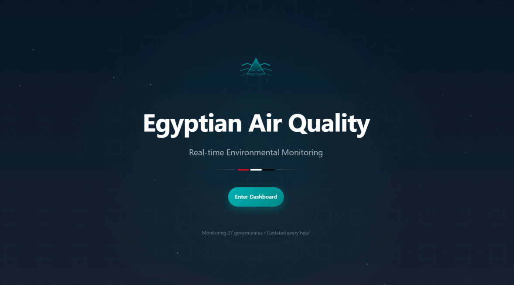
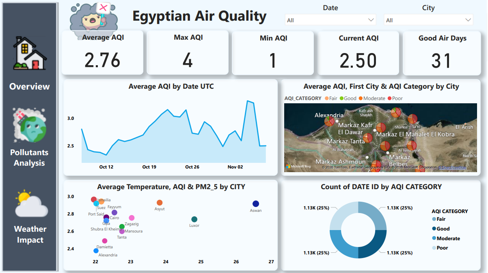
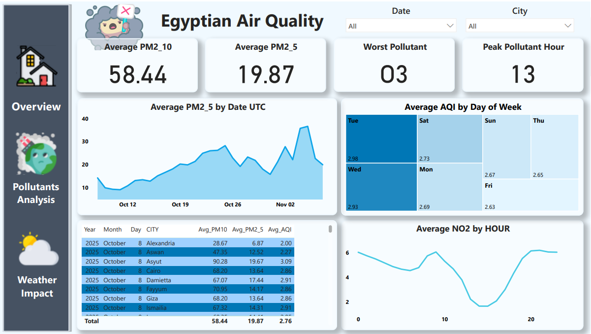
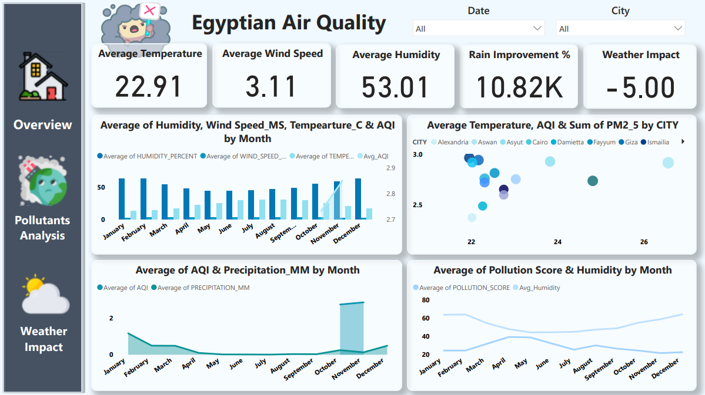

# Data Exploration and Visualization Project (ITI)
Built end-to-end ETL pipeline extracting air quality data (PM2.5, PM10, CO2) from NASA and 
OpenWeather APIs into Snowflake data warehouse - Implemented dbt transformations 
and Airflow orchestration for monthly refreshes
## Dashboard Preview

